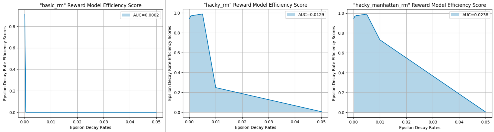

# Study of the impact of the reward model on the efficacy of learned policies

## 1. Description of the goal and content of the notebook

### Goal (informal)

We want a scalar metric that captures how *useful* a reward model (R) is for producing, early in training, a Q-table that induces a policy which:
   - (1) reaches the FrozenLake goal
   - (2) does so by a short path.
   
Intuitively: a good reward model should "guide" the agent quickly toward a minimal-length path to the goal.

---

### Experimentation sand-box

- We use the classic $(8\times 8)$ FrozenLake environment with `is_slippery=False`.
- We define 3 reward models:

   - `basic_rm`: Basic reward model giving a reward of 1 for reaching the goal and 0 otherwise.
   
   - `hacky_rm`: Hacky reward model giving a reward of 10 for reaching the goal, -10 for falling in a hole, and -1 otherwise to push encourage minimal path length.
   
   - `hacky_manhattan_rm`: Hacky reward model giving a reward of 10 for reaching the goal, -10 for falling in a hole, and a negative reward based on the Manhattan distance to the goal otherwise to encourage further minimal path length.

---

### The proposed metric

- We propose a simple metric called "reward model efficiency score" or $RMES$.

- Given a reward model $R(s)$ which assigns a reward to each state $s$ reached when interacting with the environment, $RMES$ is computed as follows:

   1. We define beforehand a fixed pool of increasing decay rates for the $\epsilon$ parameter of the $\epsilon$-greedy policy in Q-learning.

   2. For each decay rate, we train our agent via Q-learning.

   3. After every single episode during training, we evaluate the "quality" of the current state of the Q-table by:
      - [a] Computing the length of the "path to the goal" suggested by following greedily the entries of the Q-table.
      - [b] If the greedy path does lead to the goal, we assign a "local score" to the current episode which is defined by: $$PerEpisodeScore = \frac{MinimumPathLength}{DiscoveredPathLength}$$
      with $MinimumPathLength$ being the manhattan distance from start state to goal state (in default 8 by 8 FrozenLake this is just 14 steps). In case the greedy path doesn't lead to the goal, we set the score to 0 which is equivalent to saying that $DiscoveredPathLength = \infty$
   
   4. At the end of the training, we compute an average of these scores, which we call "decay rate efficiency score" and which is defined by:$$DecayRateEfficiencyScore = \frac{Sum(PerEpisodeScores)}{NumberOfEpisodes}$$This score is by design normalized between 0 and 1, and represents effectively the area under the curve of the per-episode scores.

   5. After obtaining the different decay rate efficiency scores, we compute the area under the curve obtaind by plotting these scores against the decay rates, effectively computing a final score that represents the "quality" of the reward model, defined by:$$RewardModelEfficiencyScore = AUC(DecayRateEfficiencyScores / DecayRates)$$

- This score effectively represents how "fast" the q-learning algorithm reaches an optimal solution: as we increase the $\epsilon$ decay rate, the agent has less time to explore its environment, and a less efficient reward model would lead to sub-optimal solutions in this case, while a more informative reward model should still be able to guide the agent towards an optimal solution even under limited exploration time, thus leading to "quicker learning of better solutions".

- This metric we propose aims to represent exactly that, and as we can see in the plots generated in this notebook, the $RewardModelEfficiencyScore$ is highest for `hacky_manhattan_rm`, then `hacky_rm`, and finally the least informative `basic_rm`, as we may intuitively suppose.
